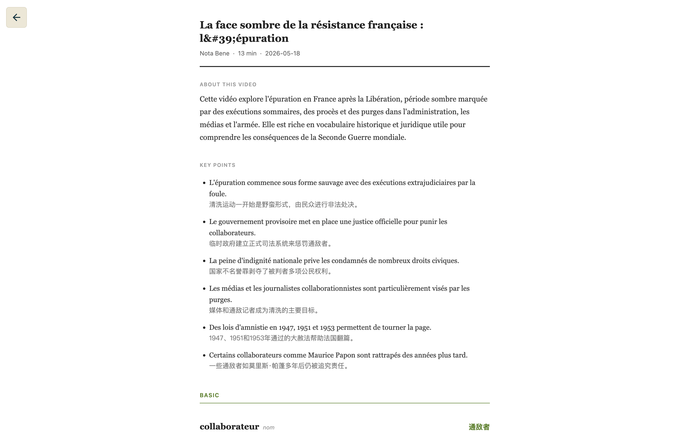
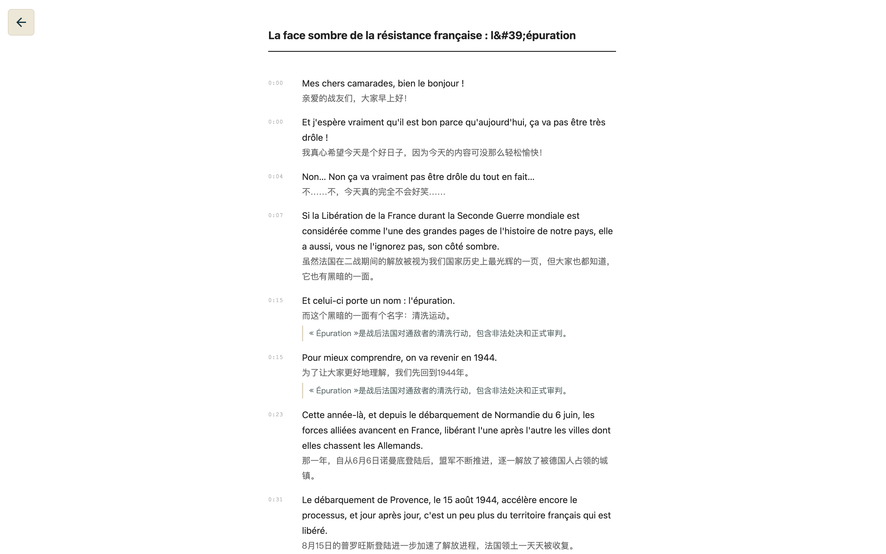
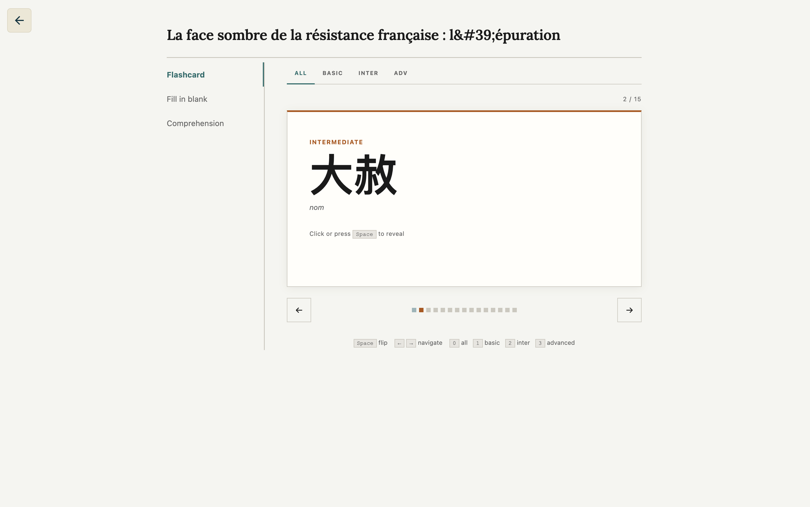
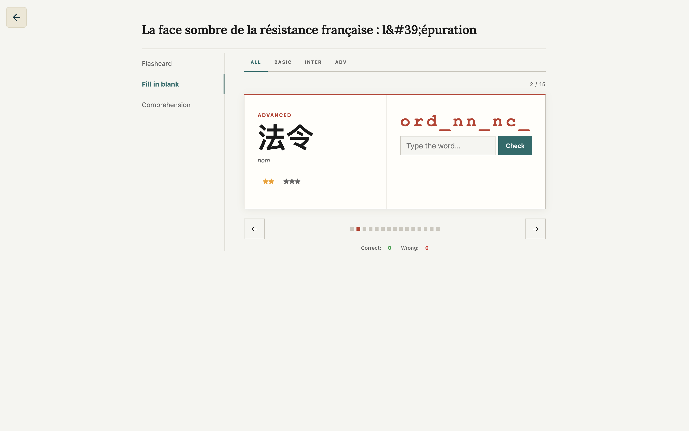
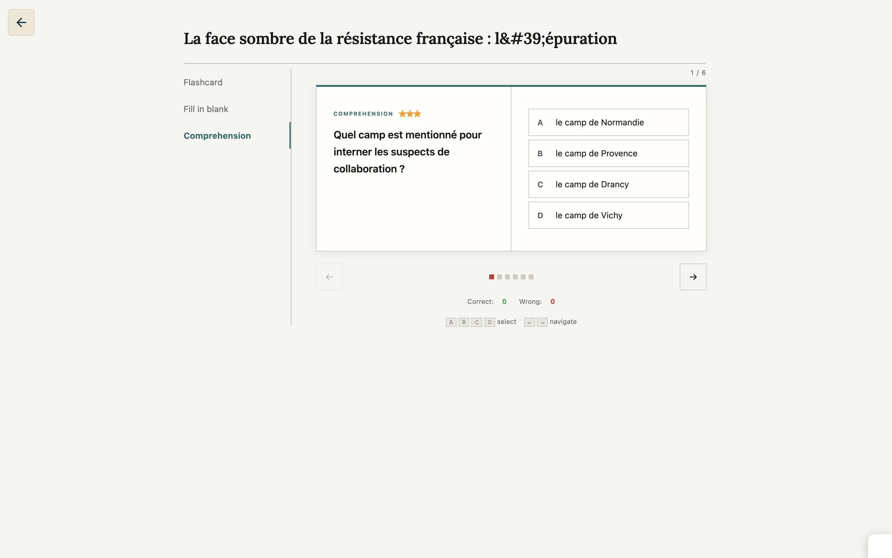

# ytlang

Generate language teaching materials from YouTube videos, so that you can tailor your learning process.

Currently supports learning **English, French, Spanish, Chinese, Japanese, and Korean** from YouTube.

Given a YouTube URL, produces:
- **`recording.html`** — embedded video, live bilingual transcript strip, vocab flashcard panel
- **`handout.html`** — printable worksheet with vocab by level (basic / intermediate / advanced)
- **`transcript.html`** — bilingual reference transcript with context annotations
- **`quiz.html`** — interactive quiz with vocab and comprehension questions


<table>
  <tr>
    <td align="center"><br><em>Recording</em></td>
    <td align="center"><br><em>Handout</em></td>
    <td align="center"><br><em>Transcript</em></td>
  </tr>
  <tr>
    <td align="center"><br><em>Quiz – Flashcards</em></td>
    <td align="center"><br><em>Quiz – Fill in the Blank</em></td>
    <td align="center"><br><em>Quiz – Q&A</em></td>
  </tr>
</table>

## demo

Two pre-generated lessons are included in [`examples/`](examples/) — no setup or API key needed. Clone the repo and open them directly in your browser:

| Video | Source | Native | Open |
|-------|--------|--------|------|
| [Gordon Ramsay Answers Cooking Questions From Twitter](https://www.youtube.com/watch?v=kJ5PCbtiCpk) | English | Chinese | [recording](examples/kJ5PCbtiCpk/recording.html) · [handout](examples/kJ5PCbtiCpk/handout.html) · [transcript](examples/kJ5PCbtiCpk/transcript.html) · [quiz](examples/kJ5PCbtiCpk/quiz.html) |
| [Sénégal : arbres de vie — ARTE Reportage](https://www.youtube.com/watch?v=Sqc3go6rmjM) | French | Korean | [recording](examples/Sqc3go6rmjM/recording.html) · [handout](examples/Sqc3go6rmjM/handout.html) · [transcript](examples/Sqc3go6rmjM/transcript.html) · [quiz](examples/Sqc3go6rmjM/quiz.html) |


## Setup

**Requirements:** Python 3.11+, [`uv`](https://docs.astral.sh/uv/getting-started/installation/)
| Package | Purpose |
|---|---|
| `youtube-transcript-api` | Fetch YouTube captions |
| `yt-dlp` | Fetch enriched video metadata (subprocess) |
| `xai-sdk` | Grok API client (preclean, translation, analysis) |
| `typer` | CLI framework |
| `python-dotenv` | Load `.env` file |

### 1. Clone and install

```bash
git clone https://github.com/QoriZii/ytlang.git
cd ytlang
uv sync
```

### 2. Config

```bash
cp .env.example .env
```

Edit `.env` and fill in your values — at minimum, set your xAI API key (get one free at [console.x.ai](https://console.x.ai)):

```env
XAI_API_KEY=xai-...              # required
XAI_MODEL=grok-4-1-fast-non-reasoning   # LLM model for all calls
YTLANG_OUTDIR=examples                   # where lessons are saved
```

### 3. Generate your first lesson

Copy a YouTube video URL from your browser and paste it into the command. By default, the video is treated as English and the lesson is generated for Chinese-speaking learners. See [Usage](#usage) below for other language combinations.

```bash
uv run ytlang prep 'https://www.youtube.com/watch?v=...' --render
```

This fetches the transcript, translates it, generates vocab and quiz, and renders four HTML files into `{YTLANG_OUTDIR}/<video_id>/`.

### 4. View the lesson

```bash
uv run ytlang serve
```

This command opens `recording.html` in your browser with an embedded video player, synced bilingual transcript, and vocab cards.

## How it works

```
YouTube URL + --lang / --native
    │
    ├─ fetch       youtube-transcript-api + yt-dlp metadata
    ├─ preclean    LLM → restore punctuation, merge ASR fragments into sentences
    ├─ translate   LLM → source lang to native lang
    └─ analyze     LLM → vocab, key points, quiz, transcript notes
         │
         └─ lesson.json 
              │
              ├─ recording.html
              ├─ handout.html
              ├─ transcript.html
              └─ quiz.html
```

`lesson.json` is the source of truth. Edit vocab (add, remove, adjust levels or definitions) before rendering based on your need. Re-run `render` any time to regenerate HTML from it.

## Usage

### Single video

```bash
# English video, Chinese learner (default)
uv run ytlang prep https://www.youtube.com/watch?v=VIDEO_ID

# French video, Chinese learner
uv run ytlang prep https://www.youtube.com/watch?v=VIDEO_ID --lang fr

# Japanese video, English learner
uv run ytlang prep https://www.youtube.com/watch?v=VIDEO_ID --lang ja --native en

# Spanish video, Korean learner
uv run ytlang prep https://www.youtube.com/watch?v=VIDEO_ID --lang es --native ko

# Render lesson.json → 4 HTML files (uses most recent video if no ID given)
uv run ytlang render
uv run ytlang render VIDEO_ID

# Open recording.html in browser after rendering
uv run ytlang render --open

# Prep + render in one step
uv run ytlang prep https://www.youtube.com/watch?v=VIDEO_ID --lang fr --render

# Serve recording.html over HTTP and open in browser
uv run ytlang serve
uv run ytlang serve VIDEO_ID
```

### Reprocess (without re-fetching transcripts)

```bash
# Re-run translate + analyze on existing lesson (uses lang from lesson.json)
uv run ytlang reprocess VIDEO_ID

# Override language on reprocess
uv run ytlang reprocess VIDEO_ID --lang fr --native en

# Re-run from preclean stage (uses saved raw.json)
uv run ytlang reprocess VIDEO_ID --from-preclean

# Only re-translate, skip analysis
uv run ytlang reprocess VIDEO_ID --no-analyze

# Only re-analyze, skip translation
uv run ytlang reprocess VIDEO_ID --no-translate

# Reprocess + render
uv run ytlang reprocess VIDEO_ID --render
```

<!-- ### Batch

```bash
# Prep all URLs in a file (skips already-processed videos)
uv run ytlang batch batch/my-urls.txt

# Batch French videos for Chinese learner
uv run ytlang batch batch/french.txt --lang fr

# Batch with custom native language
uv run ytlang batch batch/japanese.txt --lang ja --native en

# Prep + render all
uv run ytlang batch batch/my-urls.txt --render

# Re-process even if lesson.json exists
uv run ytlang batch batch/my-urls.txt --no-skip
```

**URL file format** (`batch/example.txt`):

```
# Comments start with #, blank lines are ignored

# Minecraft series
https://www.youtube.com/watch?v=abc123
https://youtu.be/def456
``` -->


### Output

All output goes to `examples/<video_id>/`:

```
examples/
└── abc123xyz/
    ├── raw.json           ← original ASR fragments (for reprocess --from-preclean)
    ├── lesson.json        ← edit this before re-rendering
    ├── recording.html
    ├── handout.html
    ├── transcript.html
    └── quiz.html
```


## Supported languages

| Code | Language | As source (learn) | As native | Vocab levels |
|------|----------|-------------------|-----------|-------------|
| `en` | English | Yes | Yes | CEFR A2–C1 |
| `fr` | French | Yes | Yes | DELF A1–DALF C1 |
| `es` | Spanish | Yes | Yes | DELE A1–C1 |
| `zh` | Chinese (Simplified) | Yes | Yes | HSK 1–6+ |
| `ja` | Japanese | Yes | Yes | JLPT N5–N1 |
| `ko` | Korean | Yes | Yes | TOPIK I–II |

## Future work

- [ ] More LLM providers — support OpenAI, Claude, Gemini, and local models alongside Grok
- [ ] More languages — Arabic, German, Portuguese, Hindi, Thai, Vietnamese
- [ ] More quiz types — listening comprehension, sentence reordering, dictation, shadowing exercises
- [ ] Batch processing — prep multiple videos from a URL list in one command

